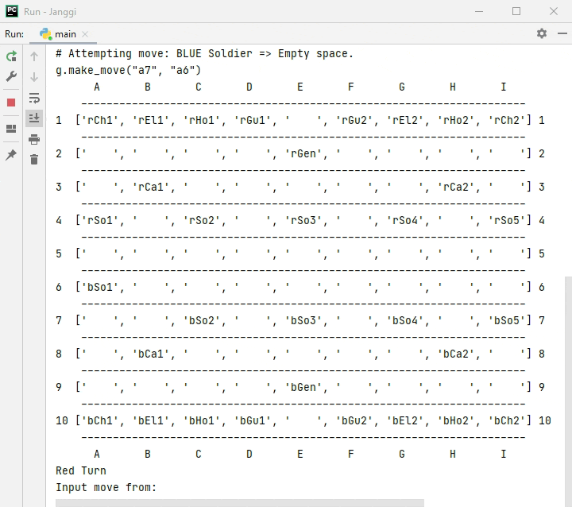

# Janggi
Portfolio project for CS162

A command line interpretation of [Janggi (Korean Chess)](http://en.wikipedia.org/wiki/Janggi)

## Techologies
Python 3.8

## Approach
My approach to this project was to tackle broad, fundamental systems first before moving on to specific game mechanics. The first systems implemented were to convert the expected input of the user to a coordinate system that made more sense from my designer perspective and a system for storing locations followed by a terminal GUI outputting those positions for debugging purposes. My system uses one master game class that handles most of the game logic, and separate piece classes that handle logic that is dependant on invidivual pieces. Per requirements of the program, two mechanics are ignored in this program that would be present in a typical Janggi game. The first is the ability for Generals to force a draw by ending their turn in line of sight of the opposing General. In fact, no draw state exists in this program and the game will continue on until a checkmate occurs. The second mechanic is allowing the players to switch the positions of their horses and elephants.

## Piece Overview
Pieces are represented on the board textually using 4 characters. The first letter is 'r' or 'b' for red or blue, representing the color of the piece. The second and third character represents the type of piece. The final character is a number for pieces that have more than one instance, otherwise it is the letter 'n' for the General. Below are some examples:

- rGen (Red General)
- bCh1 (Blue Chariot #1)
- rHo2 (Red Chariot #2)
- bEl2 (Blue Chariot #2)
- rSo3 (Red Soldier #3)
- bGu1 (Blue Guard #1)
- rCa2 (Red Cannon #2)

## Animations
The following animations demonstrate some functionality of the program when utilizing the terminal GUI.

### Moving the pieces around the board.   

